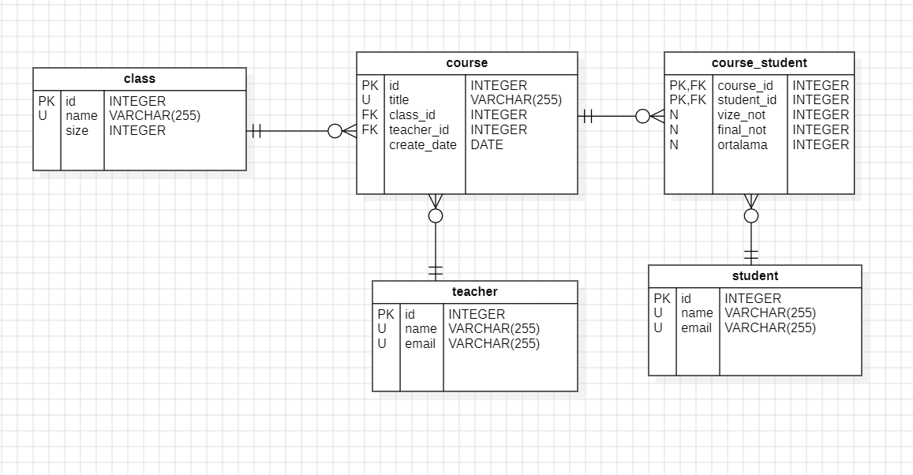

# SPRING-School-RESTAPI
This REST API provides a simple school management API experience. It's implemented using MySQL and the Spring framework.

How to Run:

Clone the project to your own repository.\
Then create a MySQL connection.\
Create a MySQL schema.\
Run the school.sql file with MySQL Workbench.\
After that, modify the application.properties file under the spring folders as follows.
```

logging.level.root=warn

server.port=3000
server.servlet.contextPath=/api
spring.datasource.url=jdbc:mysql://localhost:3306/[<Your Connection schema name>]
spring.datasource.username=[<Your Connection Username>]
spring.datasource.password=[<Your Connection Password>]

spring.main.allow-circular-references=true

```


After that your project is ready to run. You can run it using the **SchoolprojectApplication.java** file.


The ER Diagram of the application is as follows.




**Entities;**


Teacher\
Courses\
Students


Endpoints\
**/api +**

**Teacher** \
[GET /teachers](http://localhost:3000/api/teachers) \
[POST /teachers](http://localhost:3000/api/teachers) \
[GET /teachers/{teacherid}](http://localhost:3000/api/teachers/1) \
[DELETE /teachers/{teacherid}](http://localhost:3000/api/teachers/1) \
[PUT /teachers/{teacherid}](http://localhost:3000/api/teachers/1) \
[GET /teachers/{teacherid}/courses](http://localhost:3000/api/teachers/1/courses)

**Courses** \
[GET /courses](http://localhost:3000/api/courses) \
[POST /courses](http://localhost:3000/api/courses) \
[GET /courses/{courseid}](http://localhost:3000/api/courses/1) \
[DELETE /courses/{courseid}](http://localhost:3000/api/courses/1) \
[PUT  /courses/{courseid}](http://localhost:3000/api/courses/1) \
**CoursesAndStudents** \
[GET /courses/{id}/students](http://localhost:3000/api/courses/1/students) 

**Students** \
[GET /students](http://localhost:3000/api/students) \
[POST /students](http://localhost:3000/api/students) \
[GET /students/{studentid}](http://localhost:3000/api/students/1) \
[DELETE /students/{studentid}](http://localhost:3000/api/students/1) \
[PUT /students/{studentid}](http://localhost:3000/api/students/1) \
**StudentAndCourses** \
[GET /students/{id}/courses](http://localhost:3000/api/students/1/courses) 


**Class** \
[GET /class](http://localhost:3000/api/class) \
[POST /class](http://localhost:3000/api/class) \
[DELETE /class/{classid}](http://localhost:3000/api/class/1) 
	 


